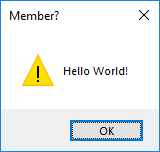

# Member


Timed Messagebox Reminders

> 'Member when there weren't as many JavaScript frameworks? 'Member?

Launchable from the command line for quick and easy reminders.

## Installation

```bash
pip install git+https://github.com/Pebaz/Member
```

## Usage

```powershell
# Reminder is shown in 10 seconds
member 10s "Hello World"

# Reminder is shown in 2 minutes
member 2m "Hello World!"

# Reminder is shown in 2 hours and 30 minutes
member 2.5 "Hello World"
```


